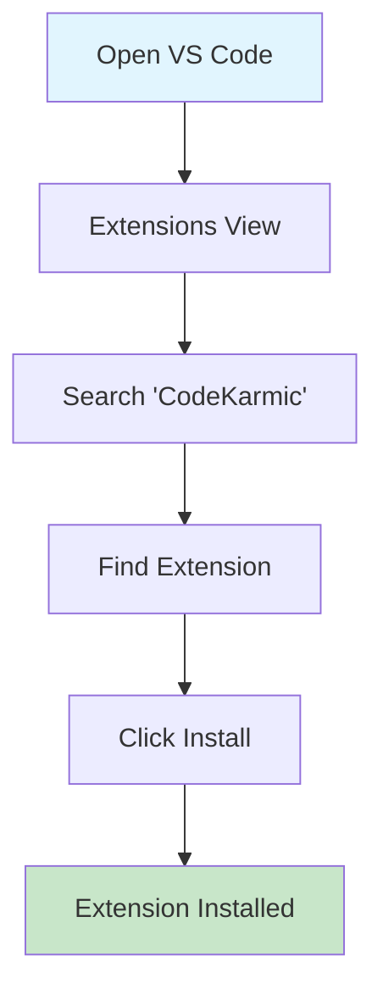
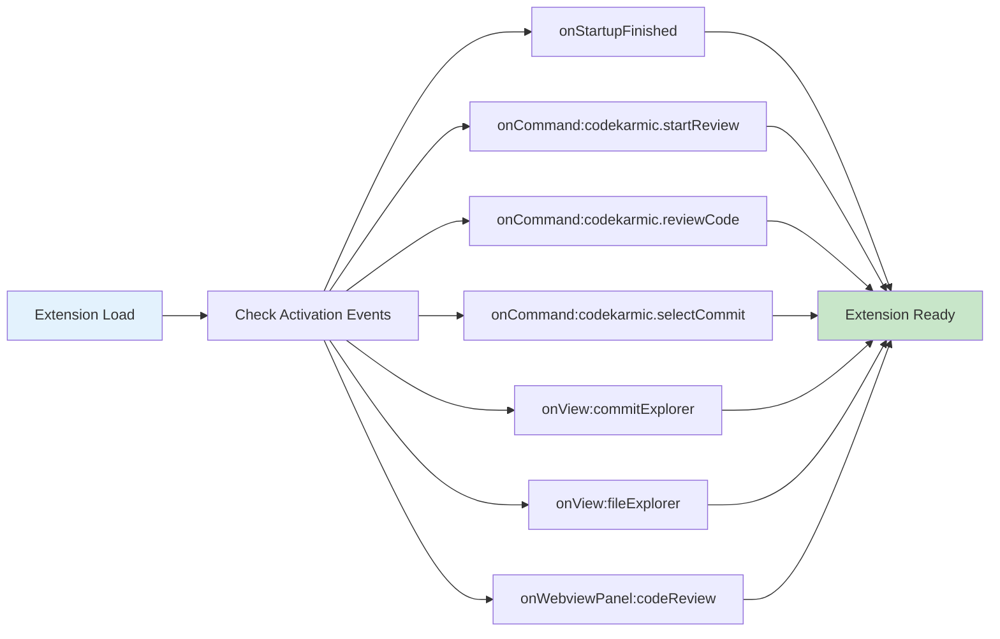
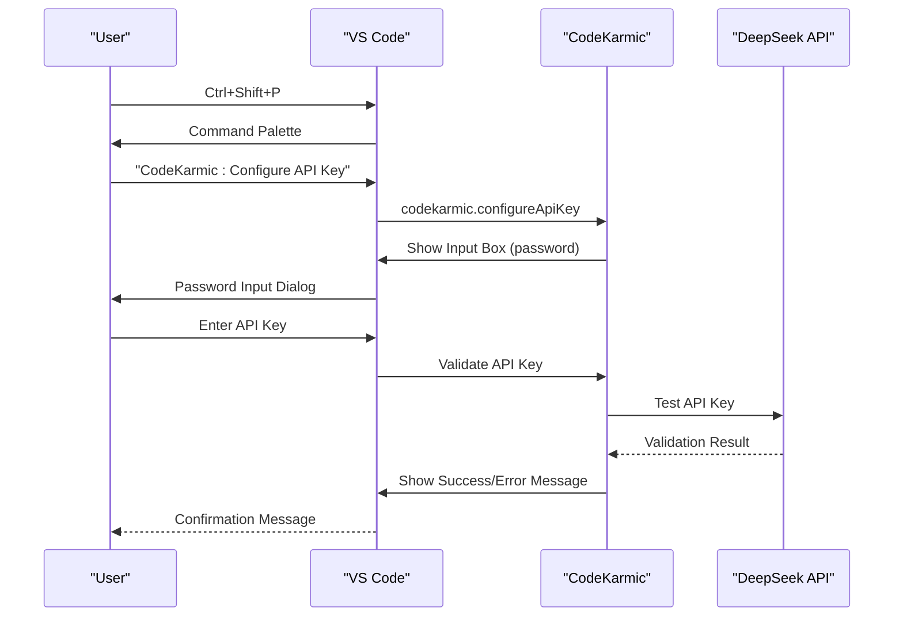
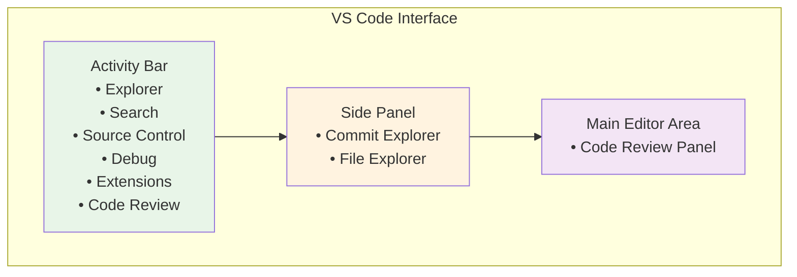
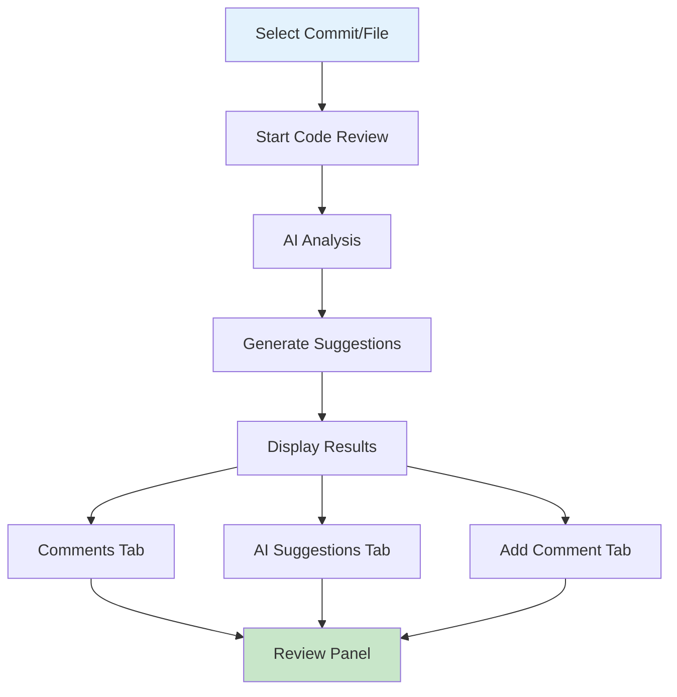
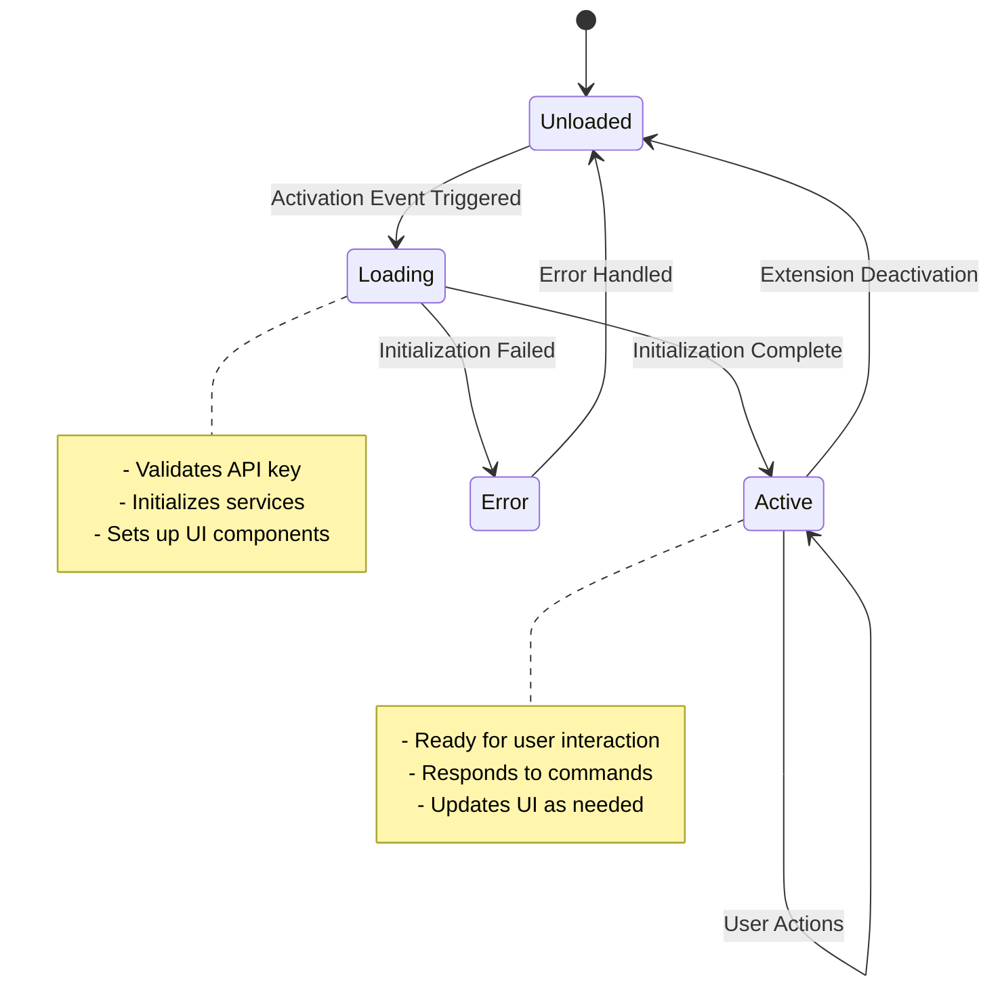

# Getting Started

<cite>
**Referenced Files in This Document**
- [package.json](file://package.json)
- [src/extension.ts](file://src/extension.ts)
- [src/config/appConfig.ts](file://src/config/appConfig.ts)
- [src/models/providers/deepseek.ts](file://src/models/providers/deepseek.ts)
- [src/ui/views/reviewPanel.ts](file://src/ui/views/reviewPanel.ts)
- [src/ui/components/commitExplorer.ts](file://src/ui/components/commitExplorer.ts)
- [src/ui/components/fileExplorer.ts](file://src/ui/components/fileExplorer.ts)
- [src/i18n/index.ts](file://src/i18n/index.ts)
- [README.md](file://README.md)
- [docs/en/user-guide.md](file://docs/en/user-guide.md)
</cite>

## Table of Contents
1. [Introduction](#introduction)
2. [Installation from VS Code Marketplace](#installation-from-vs-code-marketplace)
3. [Initial Setup and Activation](#initial-setup-and-activation)
4. [API Key Configuration](#api-key-configuration)
5. [Understanding the UI Layout](#understanding-the-ui-layout)
6. [First-Time Usage Walkthrough](#first-time-usage-walkthrough)
7. [Activation Events and Startup Behavior](#activation-events-and-startup-behavior)
8. [Common Beginner Issues and Troubleshooting](#common-beginner-issues-and-troubleshooting)
9. [Next Steps](#next-steps)

## Introduction

CodeKarmic is an AI-powered code review assistant for VS Code that leverages the DeepSeek R1 model to analyze Git commit changes and provide intelligent code review suggestions. This guide will walk you through the complete setup process, from installation to your first code review session.

The extension integrates seamlessly with your existing Git workflow, providing automated code analysis, suggestions for improvements, and detailed review reports to help you maintain high code quality standards.

## Installation from VS Code Marketplace

### Step 1: Access VS Code Marketplace

1. Open Visual Studio Code
2. Navigate to the Extensions view by clicking on the Extensions icon in the Activity Bar or pressing `Ctrl+Shift+X` (Windows/Linux) or `Cmd+Shift+X` (macOS)
3. In the search bar, type "CodeKarmic" or "codekarmic"
4. Locate the extension published by "nesnilnehc"
5. Click the "Install" button

**Diagram sources**
- [package.json](file://package.json#L2-L7)

### Step 2: Verify Installation

After installation, you should see the CodeKarmic icon in the Activity Bar (usually on the left side of VS Code). The icon appears as a code review symbol with the extension's branding.

**Section sources**
- [package.json](file://package.json#L210-L232)

## Initial Setup and Activation

### Understanding Activation Events

CodeKarmic uses a sophisticated activation system defined in the `activationEvents` array in package.json. These events trigger the extension's initialization based on user actions:

**Diagram sources**
- [package.json](file://package.json#L26-L35)

### Automatic Activation Process

When you first install CodeKarmic, the extension activates automatically during VS Code startup. The activation process includes:

1. **Configuration Initialization**: Loading user preferences and settings
2. **API Key Validation**: Checking if an API key is configured
3. **Service Registration**: Setting up Git services and review managers
4. **UI Component Creation**: Building the commit and file explorer views

**Section sources**
- [src/extension.ts](file://src/extension.ts#L20-L67)

## API Key Configuration

### Method 1: Using the Command Palette

The most straightforward way to configure your API key is through the command palette:

1. **Open Command Palette**: Press `Ctrl+Shift+P` (Windows/Linux) or `Cmd+Shift+P` (macOS)
2. **Search for Configuration**: Type "CodeKarmic: Configure API Key"
3. **Enter Your API Key**: A password input box will appear where you can paste your DeepSeek API key
4. **Validation**: The extension will automatically validate your API key with the DeepSeek service

**Diagram sources**
- [src/extension.ts](file://src/extension.ts#L82-L97)

### Method 2: Manual Configuration

Alternatively, you can manually configure the API key through VS Code settings:

1. Open Settings (`Ctrl+,` or `Cmd+,`)
2. Search for "codekarmic.apiKey"
3. Paste your DeepSeek API key in the provided field
4. The extension will automatically detect the change and validate the key

### API Key Security

- **Local Storage**: API keys are stored locally in your VS Code settings
- **Encryption**: Keys are encrypted using VS Code's secure storage mechanisms
- **Scope**: Keys are machine-specific and not shared across devices

**Section sources**
- [src/extension.ts](file://src/extension.ts#L37-L66)
- [src/config/appConfig.ts](file://src/config/appConfig.ts#L145-L156)

## Understanding the UI Layout

### Activity Bar Integration

After successful setup, CodeKarmic adds a dedicated Code Review container to the Activity Bar:

**Diagram sources**
- [package.json](file://package.json#L210-L232)

### Code Review Container

The Code Review container provides two primary views:

1. **Commit Explorer**: Lists all Git commits in your repository
2. **File Explorer**: Shows files changed in the selected commit

### Commit Explorer Features

- **Commit List**: Displays recent commits with author, date, and message
- **Commit Details**: Shows metadata like hash, author email, and file count
- **Interactive Selection**: Click on any commit to select it for review

### File Explorer Features

- **File List**: Shows all files changed in the selected commit
- **Change Statistics**: Indicates additions, deletions, and file status
- **File Status Icons**: Visual indicators for added, modified, deleted, renamed, or copied files

**Section sources**
- [src/ui/components/commitExplorer.ts](file://src/ui/components/commitExplorer.ts#L36-L127)
- [src/ui/components/fileExplorer.ts](file://src/ui/components/fileExplorer.ts#L20-L98)

## First-Time Usage Walkthrough

### Step 1: Prepare Your Workspace

Ensure you have:
- A Git repository with commit history
- VS Code opened in the root directory of your project
- An internet connection for API access

### Step 2: Open the Code Review Sidebar

1. Click on the Code Review icon in the Activity Bar (it looks like a code review symbol)
2. The Commit Explorer will load automatically, displaying your recent commits

### Step 3: Select a Commit for Review

1. Browse through the commit list in the Commit Explorer
2. Click on any commit to select it
3. The File Explorer will update to show the files changed in that commit

### Step 4: Start the Code Review Process

There are multiple ways to start a code review:

**Method 1: Using the Commit Explorer**
1. Right-click on the selected commit
2. Choose "Start Code Review" from the context menu

**Method 2: Using the Command Palette**
1. Press `Ctrl+Shift+P` or `Cmd+Shift+P`
2. Type "CodeKarmic: Start Code Review"
3. Select the command from the list

**Method 3: Using the File Explorer**
1. Select a file in the File Explorer
2. Right-click and choose "Review File with AI"

### Step 5: View AI Suggestions

Once the review process completes, a Code Review Panel will open:

**Diagram sources**
- [src/ui/views/reviewPanel.ts](file://src/ui/views/reviewPanel.ts#L149-L239)

### Step 6: Interact with the Review Results

The review panel provides multiple tabs:

- **Comments**: View existing comments and discussions
- **AI Suggestions**: See AI-generated improvement suggestions
- **Add Comment**: Add your own comments to specific lines

**Section sources**
- [src/extension.ts](file://src/extension.ts#L102-L139)

## Activation Events and Startup Behavior

### How Activation Events Work

CodeKarmic's activation system ensures optimal performance by loading only when needed:

**Diagram sources**
- [package.json](file://package.json#L26-L35)

### Key Activation Triggers

1. **onStartupFinished**: Basic extension activation during VS Code startup
2. **onCommand**: Specific commands that require the extension to be loaded
3. **onView**: When users interact with CodeKarmic views
4. **onWebviewPanel**: When the review panel is opened

### Performance Considerations

- **Lazy Loading**: Services are initialized only when needed
- **Memory Management**: Resources are cleaned up when not in use
- **Network Optimization**: API requests are batched and cached when appropriate

**Section sources**
- [package.json](file://package.json#L26-L35)
- [src/extension.ts](file://src/extension.ts#L20-L67)

## Common Beginner Issues and Troubleshooting

### Issue 1: Missing Workspace Folder

**Problem**: "No workspace folder found" error when trying to start a review

**Solution**:
1. Open a folder containing a Git repository in VS Code
2. Go to `File > Open Folder...` and select your project directory
3. Ensure the folder contains a `.git` directory

**Prevention**:
- Always open VS Code from your project's root directory
- Verify the presence of `.git` folder in your project root

### Issue 2: Invalid API Key

**Problem**: API key validation fails or you receive authentication errors

**Solution**:
1. Reconfigure your API key using `CodeKarmic: Configure API Key`
2. Double-check that you're using the correct DeepSeek API key
3. Verify your API key hasn't expired or been revoked
4. Ensure you have sufficient credits or subscription for the DeepSeek service

**Prevention**:
- Store your API key securely
- Regularly test your API key validity
- Monitor your usage to avoid unexpected charges

### Issue 3: No Commits Found

**Problem**: Commit Explorer shows "No commits found" message

**Solution**:
1. Ensure you're working in a Git repository
2. Check if your repository has commit history
3. Verify you have permission to access the repository
4. Try refreshing the commit list using the refresh button

**Prevention**:
- Make sure your repository is properly initialized with Git
- Have at least one commit in your repository history
- Use repositories with active development

### Issue 4: Large File Size Limitations

**Problem**: Some files aren't reviewed due to size limitations

**Solution**:
1. Check the `codekarmic.maxFileSizeKb` setting in VS Code settings
2. Increase the limit if needed (default is 100KB)
3. Consider breaking down large files into smaller components

**Prevention**:
- Monitor file sizes in your repository
- Use the exclusion patterns to skip unnecessary files
- Review large files separately from smaller ones

### Issue 5: Network Connectivity Problems

**Problem**: API requests fail due to network issues

**Solution**:
1. Check your internet connection
2. Verify firewall settings aren't blocking the extension
3. Try accessing the DeepSeek API directly in your browser
4. Wait for temporary network issues to resolve

**Prevention**:
- Maintain a stable internet connection
- Configure proxy settings if required by your network
- Monitor API service status

### Troubleshooting Commands

CodeKarmic provides several built-in troubleshooting commands:

- **Debug Git Functionality**: `CodeKarmic: Debug Git`
- **Refresh Commits**: `CodeKarmic: Refresh Commits`
- **Refresh Files**: `CodeKarmic: Refresh Files`

These commands can help diagnose and resolve various issues with the extension's functionality.

**Section sources**
- [src/extension.ts](file://src/extension.ts#L102-L139)
- [src/ui/components/commitExplorer.ts](file://src/ui/components/commitExplorer.ts#L58-L92)

## Next Steps

### Advanced Configuration

Once you're comfortable with the basic setup, explore these advanced features:

1. **Custom AI Models**: Configure different AI models for specialized review needs
2. **Language Preferences**: Switch between English and Chinese interfaces
3. **File Exclusions**: Customize which file types are excluded from reviews
4. **Review Reports**: Generate comprehensive reports for team reviews

### Best Practices

- **Regular API Key Updates**: Keep your API key current and secure
- **Commit Organization**: Maintain clear commit messages for better review context
- **Review Workflow**: Integrate CodeKarmic reviews into your existing code review process
- **Team Collaboration**: Share configurations and review standards across your team

### Getting Help

If you encounter issues or need assistance:

1. **Documentation**: Refer to the [User Guide](file://docs/en/user-guide.md) for detailed information
2. **GitHub Issues**: Report bugs or request features on the [GitHub repository](https://github.com/nesnilnehc/CodeKarmic/issues)
3. **Community Support**: Engage with the community for tips and best practices

### Extension Updates

Stay informed about updates and new features by:

- Checking the VS Code Marketplace for version updates
- Reviewing the [CHANGELOG.md](file://CHANGELOG.md) for release notes
- Enabling automatic updates in VS Code settings

**Section sources**
- [README.md](file://README.md#L8-L24)
- [docs/en/user-guide.md](file://docs/en/user-guide.md#L48-L60)