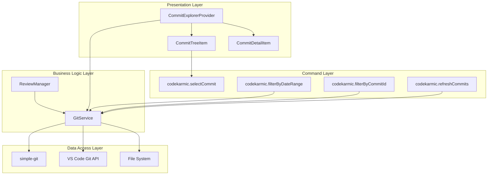
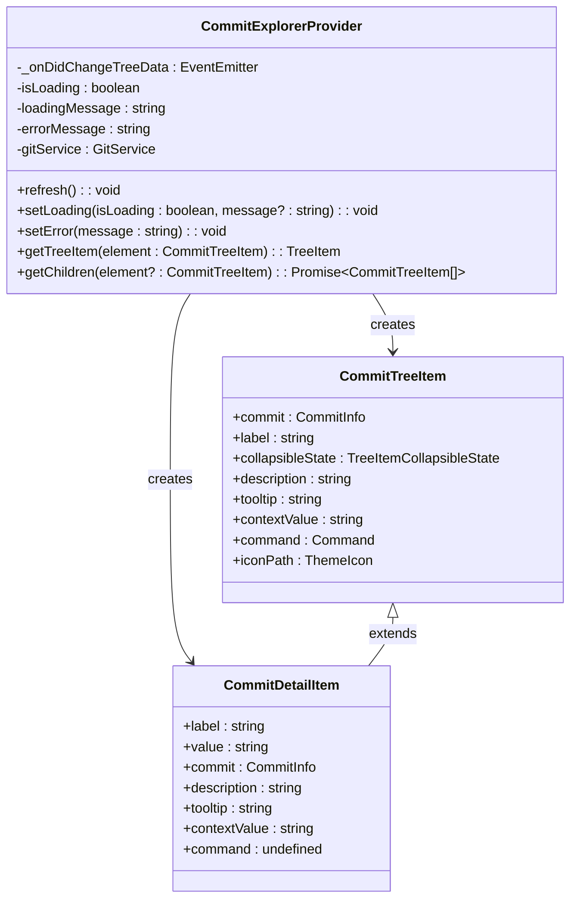
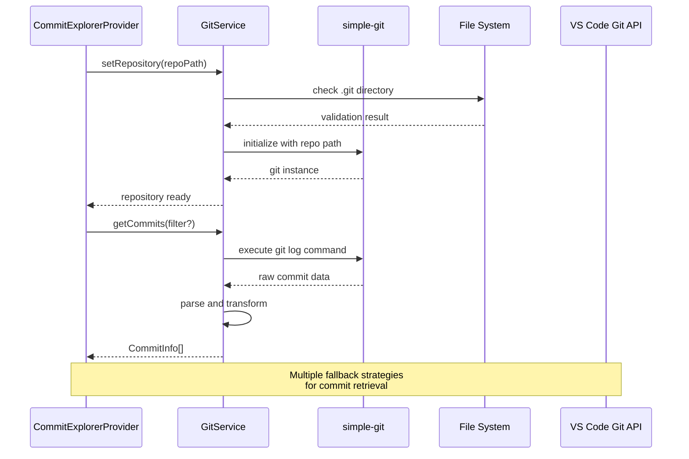
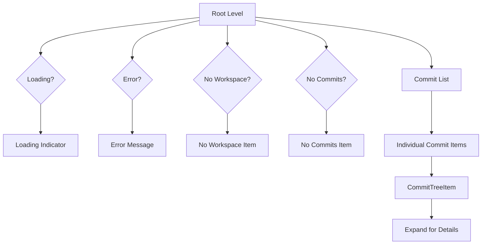
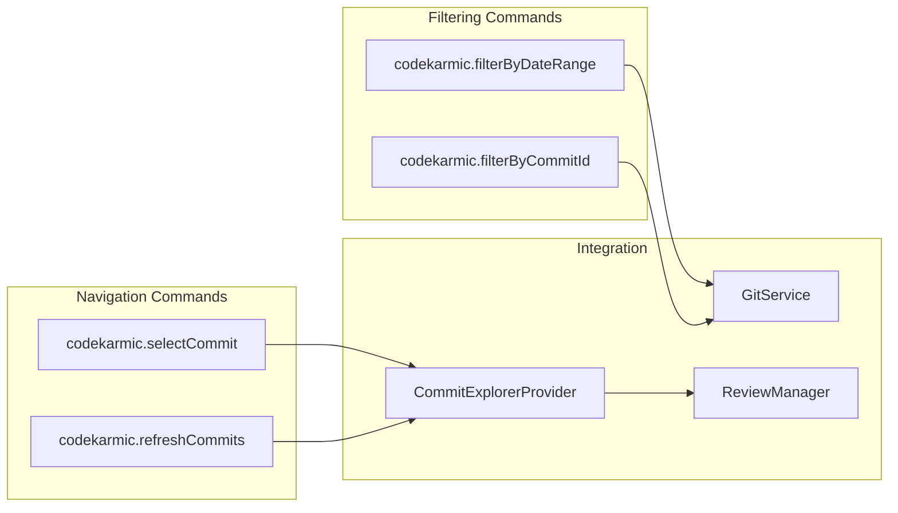
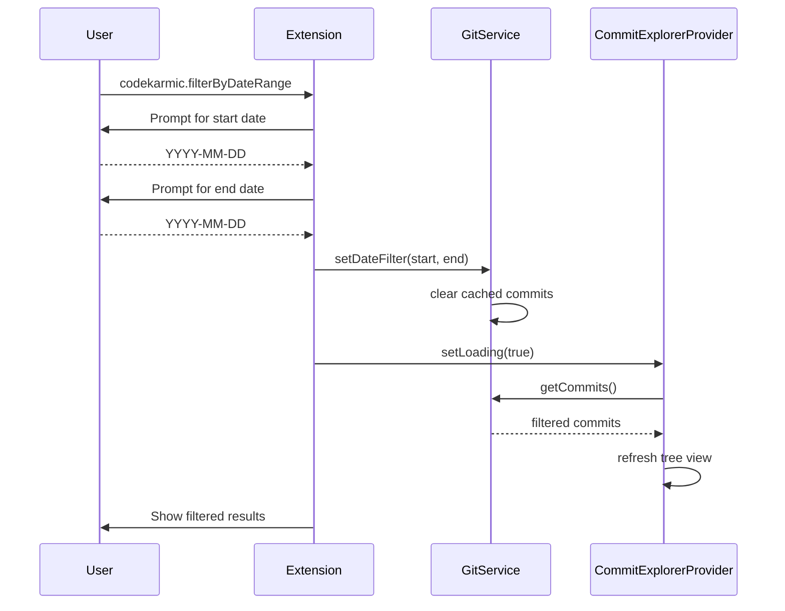
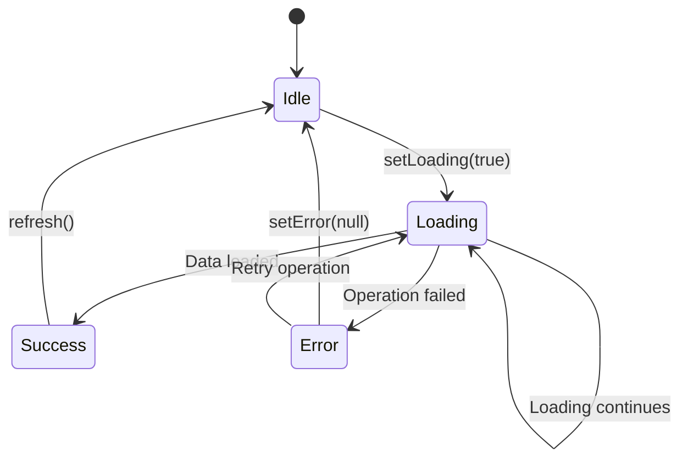
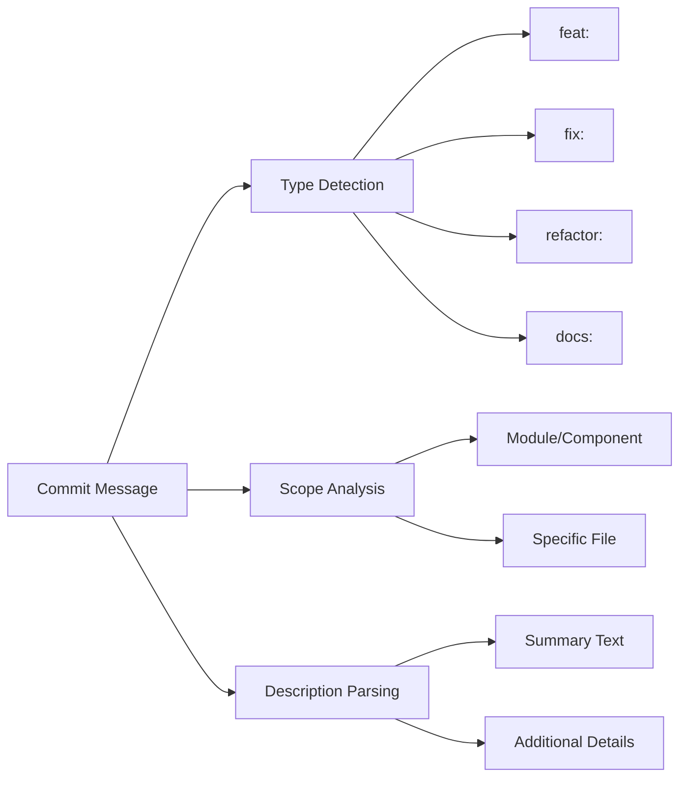

# Navigating Commits

<cite>
**Referenced Files in This Document**
- [commitExplorer.ts](file://src/ui/components/commitExplorer.ts)
- [gitService.ts](file://src/services/git/gitService.ts)
- [versionControlTypes.ts](file://src/services/git/versionControlTypes.ts)
- [extension.ts](file://src/extension.ts)
- [index.ts](file://src/i18n/index.ts)
- [output.ts](file://src/i18n/en/output.ts)
- [ui.ts](file://src/i18n/en/ui.ts)
</cite>

## Table of Contents
1. [Introduction](#introduction)
2. [Architecture Overview](#architecture-overview)
3. [Core Components](#core-components)
4. [Visual Hierarchy and Tree View](#visual-hierarchy-and-tree-view)
5. [Command Integration](#command-integration)
6. [Filtering Capabilities](#filtering-capabilities)
7. [Error States and Loading Indicators](#error-states-and-loading-indicators)
8. [Common Issues and Troubleshooting](#common-issues-and-troubleshooting)
9. [Commit Metadata Interpretation](#commit-metadata-interpretation)
10. [Best Practices](#best-practices)

## Introduction

The Commit Explorer component is a sophisticated Git commit navigation system built into the CodeKarmic VS Code extension. It provides developers with an intuitive tree view interface for browsing Git commit history, enabling efficient code review workflows and commit analysis. The component integrates seamlessly with VS Code's TreeView API and leverages the powerful GitService for reliable commit data retrieval.

The Commit Explorer serves as the primary entry point for exploring repository history, offering both basic commit browsing and advanced filtering capabilities. It transforms raw Git commit data into a user-friendly hierarchical structure that enhances productivity during code review sessions.

## Architecture Overview

The Commit Explorer follows a layered architecture pattern that separates concerns between presentation, business logic, and data access layers.



**Diagram sources**
- [commitExplorer.ts](file://src/ui/components/commitExplorer.ts#L5-L172)
- [gitService.ts](file://src/services/git/gitService.ts#L45-L1201)
- [extension.ts](file://src/extension.ts#L75-L80)

**Section sources**
- [commitExplorer.ts](file://src/ui/components/commitExplorer.ts#L1-L172)
- [gitService.ts](file://src/services/git/gitService.ts#L1-L100)

## Core Components

### CommitExplorerProvider

The CommitExplorerProvider serves as the central orchestrator for the commit exploration interface. It implements VS Code's TreeDataProvider interface and manages the lifecycle of commit data display.



**Diagram sources**
- [commitExplorer.ts](file://src/ui/components/commitExplorer.ts#L5-L172)

The provider maintains several critical states:
- **Loading State**: Indicates when commit data is being fetched
- **Error State**: Displays error messages when operations fail
- **Data State**: Contains the actual commit information for display

**Section sources**
- [commitExplorer.ts](file://src/ui/components/commitExplorer.ts#L5-L172)

### GitService Integration

The CommitExplorerProvider relies heavily on the GitService for commit data retrieval and manipulation. The GitService provides robust Git operations with multiple fallback mechanisms for reliability.



**Diagram sources**
- [gitService.ts](file://src/services/git/gitService.ts#L64-L108)
- [commitExplorer.ts](file://src/ui/components/commitExplorer.ts#L75-L87)

**Section sources**
- [gitService.ts](file://src/services/git/gitService.ts#L45-L242)
- [commitExplorer.ts](file://src/ui/components/commitExplorer.ts#L75-L87)

## Visual Hierarchy and Tree View

The Commit Explorer presents commit data in a hierarchical tree structure that mirrors Git's commit graph while optimizing for usability.

### Root Level Display

At the root level, the CommitExplorerProvider displays a list of commits in chronological order, with each commit represented as a CommitTreeItem.



**Diagram sources**
- [commitExplorer.ts](file://src/ui/components/commitExplorer.ts#L36-L114)

### CommitTreeItem Structure

Each commit is rendered as a CommitTreeItem with specific visual attributes:

| Property | Description | Example |
|----------|-------------|---------|
| **Label** | Commit message (first line) | "Fix bug in authentication module" |
| **Description** | Short hash + formatted date | "a1b2c3d - Jan 15, 2024" |
| **Tooltip** | Full commit information | Complete commit message, author, date, hash |
| **Context Value** | UI state identifier | "commit" |
| **Command** | Action on click | "codekarmic.selectCommit" |
| **Icon** | Visual indicator | Git commit theme icon |

### Commit Detail View

When users expand a commit, the CommitExplorerProvider reveals detailed commit information through CommitDetailItem instances:

| Detail Type | Display Format | Purpose |
|-------------|----------------|---------|
| **Author** | "Author Name \<email\>" | Identify who made the change |
| **Date** | Formatted local date/time | Understand temporal context |
| **Hash** | Full commit hash | Precise identification for operations |
| **Files Changed** | Count of modified files | Gauge scope of changes |

**Section sources**
- [commitExplorer.ts](file://src/ui/components/commitExplorer.ts#L131-L172)

## Command Integration

The Commit Explorer integrates with several VS Code commands to provide comprehensive commit navigation and manipulation capabilities.

### Primary Commands



**Diagram sources**
- [extension.ts](file://src/extension.ts#L278-L324)
- [commitExplorer.ts](file://src/ui/components/commitExplorer.ts#L148-L152)

### Command Implementation Details

#### codekarmic.selectCommit
This command is triggered when users click on a commit in the tree view. It activates the commit selection workflow:

```typescript
// Command registration
vscode.commands.registerCommand('codekarmic.selectCommit', async (commitHash: string) => {
    try {
        // Delegate to ReviewManager for comprehensive handling
        await reviewManager.selectCommit(commitHash);
        
        // Refresh related views
        fileExplorerProvider.refresh();
    } catch (error) {
        console.error(`Error selecting commit: ${error}`);
        NotificationManager.getInstance().log(`Error selecting commit: ${error}`, 'error', true);
    }
});
```

#### codekarmic.refreshCommits
This command clears filters and forces a fresh commit retrieval:

```typescript
vscode.commands.registerCommand('codekarmic.refreshCommits', async () => {
    try {
        commitExplorerProvider.setLoading(true, UI.MESSAGES.REFRESHING_COMMITS);
        
        // Clear filters and refresh
        const gitService = new GitService();
        gitService.clearFilters();
        
        // Force refresh with timeout for loading indication
        setTimeout(async () => {
            await gitService.getCommits({ maxCount: 100 });
            commitExplorerProvider.setLoading(false);
            commitExplorerProvider.refresh();
        }, 100);
    } catch (error) {
        commitExplorerProvider.setError(`Failed to refresh commits: ${error}`);
    }
});
```

**Section sources**
- [extension.ts](file://src/extension.ts#L294-L324)
- [extension.ts](file://src/extension.ts#L372-L389)

## Filtering Capabilities

The Commit Explorer provides sophisticated filtering mechanisms to help users navigate large commit histories efficiently.

### Date Range Filtering

Date range filtering allows users to narrow down commits by temporal boundaries:



**Diagram sources**
- [extension.ts](file://src/extension.ts#L537-L576)
- [gitService.ts](file://src/services/git/gitService.ts#L817-L827)

### Commit ID Filtering

Commit ID filtering enables precise targeting of specific commits:

```typescript
async function filterByCommitId(commitExplorerProvider: CommitExplorerProvider) {
    try {
        const commitId = await vscode.window.showInputBox({
            prompt: UI.PLACEHOLDERS.COMMIT_ID,
            placeHolder: UI.PLACEHOLDERS.COMMIT_ID_PREFIX
        });
        
        if (commitId === undefined) return; // User cancelled
        
        commitExplorerProvider.setLoading(true, UI.MESSAGES.FILTERING_COMMITS);
        
        // Refresh with new filter
        setTimeout(async () => {
            commitExplorerProvider.setLoading(false);
            commitExplorerProvider.refresh();
        }, 100);
    } catch (error) {
        console.error(`Error setting commit filter: ${error}`);
        vscode.window.showErrorMessage(`Error setting commit filter: ${error}`);
    }
}
```

### Filter Implementation Details

The filtering system operates through the GitService's filter management:

| Filter Type | Implementation | Cache Behavior |
|-------------|----------------|----------------|
| **Date Range** | `since` and `until` parameters | Clears commit cache |
| **Commit ID** | Direct commit lookup | Uses commit cache |
| **Branch** | Branch-specific git log | Clears commit cache |
| **Author** | Author-based filtering | Clears commit cache |

**Section sources**
- [extension.ts](file://src/extension.ts#L537-L607)
- [gitService.ts](file://src/services/git/gitService.ts#L817-L846)

## Error States and Loading Indicators

The Commit Explorer implements comprehensive error handling and user feedback mechanisms to ensure a smooth user experience.

### Loading States

Loading states are managed through the CommitExplorerProvider's state management:



**Diagram sources**
- [commitExplorer.ts](file://src/ui/components/commitExplorer.ts#L19-L30)

### Error Handling Matrix

The Commit Explorer handles various error scenarios with appropriate user feedback:

| Error Scenario | Error State | User Feedback | Recovery Action |
|----------------|-------------|---------------|-----------------|
| **No Workspace** | `noWorkspace` | "No workspace folder open" | Open a Git repository |
| **No Commits** | `noCommits` | "No commits found" | Check repository state |
| **Git Initialization** | `error` | Detailed error message | Verify Git installation |
| **Network Issues** | `error` | "Failed to fetch commits" | Retry operation |
| **Permission Denied** | `error` | "Access denied" | Check file permissions |

### Error Item Construction

Error states are presented through specialized TreeItem instances:

```typescript
// Error item construction pattern
const errorItem = new vscode.TreeItem(OUTPUT.COMMIT_EXPLORER.ERROR_PREFIX(errorMessage));
errorItem.description = OUTPUT.COMMIT_EXPLORER.ERROR_DESCRIPTION;
errorItem.contextValue = 'error';
return [errorItem as any];
```

**Section sources**
- [commitExplorer.ts](file://src/ui/components/commitExplorer.ts#L49-L54)
- [commitExplorer.ts](file://src/ui/components/commitExplorer.ts#L109-L114)

## Common Issues and Troubleshooting

Understanding common issues helps users resolve problems quickly and effectively.

### Repository Initialization Problems

**Issue**: "No workspace folder open" error
**Cause**: VS Code workspace not pointing to a Git repository
**Solution**: 
1. Open a folder containing a `.git` directory
2. Use "File > Open Folder..." to select a Git repository
3. Verify repository integrity with `git status` in terminal

**Issue**: "Error setting repository" when repository exists
**Cause**: Permission issues or corrupted repository
**Solution**:
1. Check file system permissions
2. Run `git fsck` to verify repository integrity
3. Reinitialize repository if necessary

### Empty Commit Lists

**Issue**: "No commits found" despite having commits
**Possible Causes**:
- Repository is empty or newly initialized
- Incorrect branch selection
- Filter criteria too restrictive
- Git history rewrite operations

**Troubleshooting Steps**:
1. Verify branch selection in Git panel
2. Check commit count with `git log --oneline`
3. Clear filters using refresh command
4. Verify repository path in logs

### Performance Issues

**Issue**: Slow commit loading in large repositories
**Optimization Strategies**:
- Use date range filtering to limit scope
- Increase `maxCount` parameter for selective loading
- Enable caching mechanisms
- Consider repository maintenance (gc, repack)

**Section sources**
- [commitExplorer.ts](file://src/ui/components/commitExplorer.ts#L58-L66)
- [commitExplorer.ts](file://src/ui/components/commitExplorer.ts#L94-L98)

## Commit Metadata Interpretation

Understanding commit metadata is crucial for effective code review and navigation.

### Commit Information Structure

Each commit contains comprehensive metadata that informs the user about the change:

| Field | Type | Description | UI Representation |
|-------|------|-------------|-------------------|
| **hash** | string | Full commit SHA | Full hash in tooltip |
| **date** | string | ISO date string | Formatted local date |
| **message** | string | Commit message | Truncated label |
| **author** | string | Author name | Author field |
| **authorEmail** | string | Author email | Tooltip detail |
| **files** | string[] | Changed file paths | Files count |

### Commit Message Analysis

Commit messages follow conventional patterns that aid in understanding change scope:



**Diagram sources**
- [versionControlTypes.ts](file://src/services/git/versionControlTypes.ts#L28-L38)

### Date Formatting and Localization

Dates are presented in user-friendly formats that adapt to locale preferences:

- **Short Format**: "Jan 15, 2024" (compact display)
- **Full Format**: "January 15, 2024 14:30:25" (detailed tooltip)
- **Relative Format**: "2 days ago" (future enhancement potential)

**Section sources**
- [commitExplorer.ts](file://src/ui/components/commitExplorer.ts#L140-L145)
- [versionControlTypes.ts](file://src/services/git/versionControlTypes.ts#L28-L38)

## Best Practices

### Effective Commit Navigation

1. **Use Filtering Strategically**: Apply date ranges when dealing with large histories
2. **Leverage Keyboard Navigation**: Use arrow keys and Enter for efficient browsing
3. **Bookmark Important Commits**: Use commit hashes for quick reference
4. **Combine Filters**: Use multiple filtering criteria for precise results

### Performance Optimization

1. **Minimize Repository Size**: Regular repository maintenance improves performance
2. **Use Appropriate Filters**: Narrow scope to reduce data transfer
3. **Cache Management**: Understand when caches are cleared and refreshed
4. **Monitor Resource Usage**: Large repositories may require system optimization

### Integration with Review Workflow

1. **Sequential Review**: Navigate commits chronologically for context
2. **Branch Comparison**: Use commit explorer to understand merge conflicts
3. **Historical Analysis**: Track changes over time for pattern recognition
4. **Quality Metrics**: Monitor commit frequency and change patterns

### Error Prevention

1. **Regular Repository Maintenance**: Keep repositories clean and organized
2. **Backup Strategies**: Maintain backups of important repositories
3. **Permission Management**: Ensure adequate file system permissions
4. **Network Reliability**: Work in environments with stable network connections

The Commit Explorer component represents a sophisticated balance between functionality and usability, providing developers with powerful tools for Git commit navigation while maintaining an intuitive user interface. Its robust error handling, comprehensive filtering capabilities, and seamless integration with VS Code's ecosystem make it an essential tool for modern code review workflows.