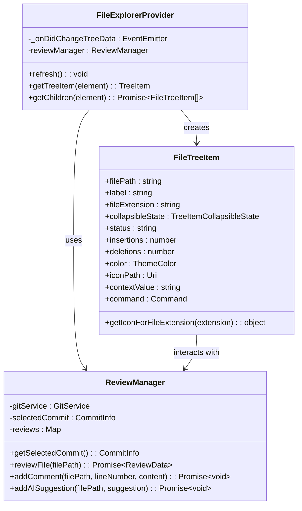
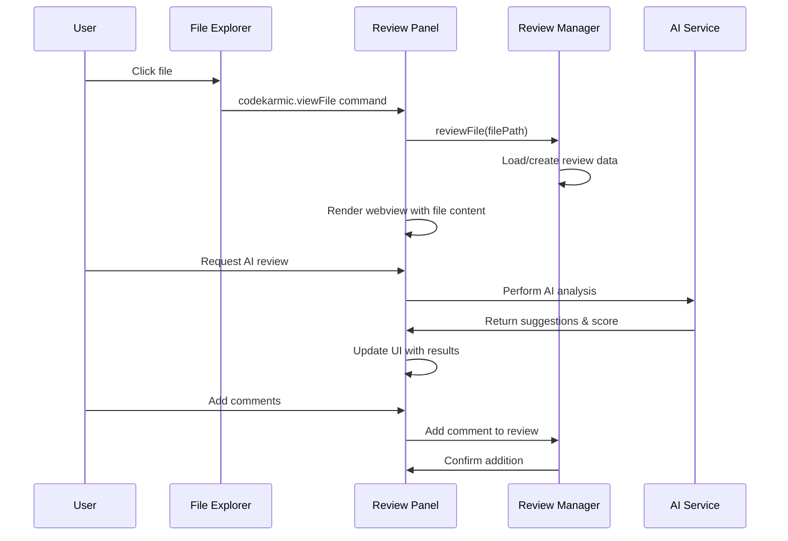
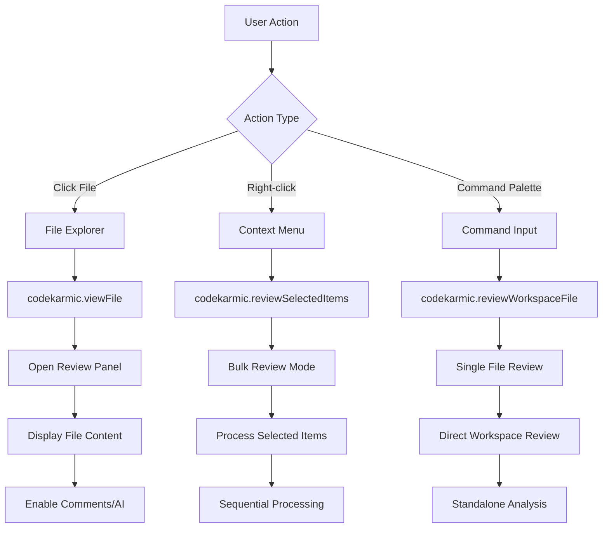
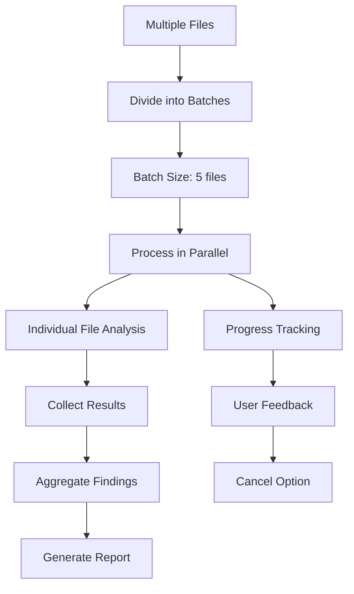
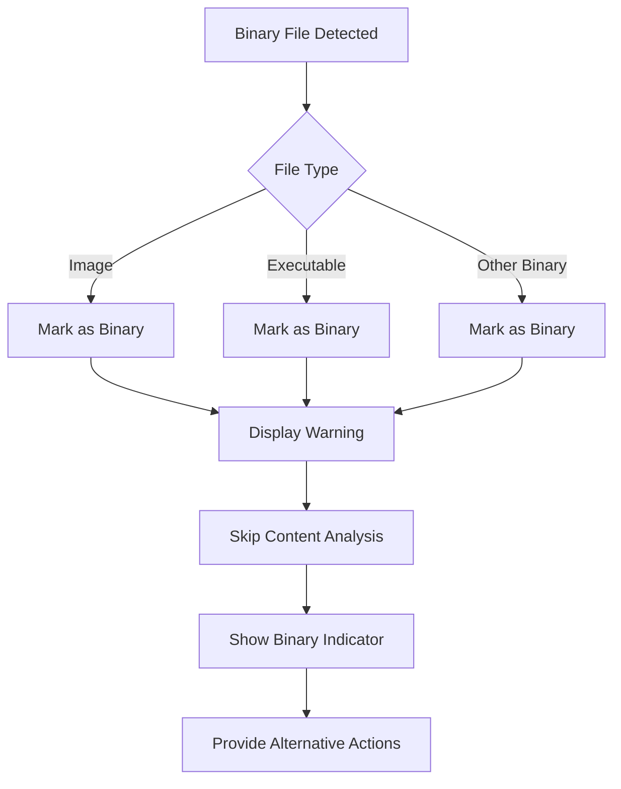

# Reviewing Files

<cite>
**Referenced Files in This Document**
- [fileExplorer.ts](file://src/ui/components/fileExplorer.ts)
- [reviewPanel.ts](file://src/ui/views/reviewPanel.ts)
- [gitService.ts](file://src/services/git/gitService.ts)
- [commitExplorer.ts](file://src/ui/components/commitExplorer.ts)
- [reviewManager.ts](file://src/services/review/reviewManager.ts)
- [extension.ts](file://src/extension.ts)
- [fileUtils.ts](file://src/utils/fileUtils.ts)
</cite>

## Table of Contents
1. [Introduction](#introduction)
2. [File Explorer Architecture](#file-explorer-architecture)
3. [File Status Display System](#file-status-display-system)
4. [Review Panel Webview](#review-panel-webview)
5. [File Selection and Navigation](#file-selection-and-navigation)
6. [Standalone Review Mode](#standalone-review-mode)
7. [Batch Review Processing](#batch-review-processing)
8. [Error Handling and Edge Cases](#error-handling-and-edge-cases)
9. [Best Practices](#best-practices)
10. [Troubleshooting Guide](#troubleshooting-guide)

## Introduction

The CodeKarmic extension provides a comprehensive file review system that enables developers to analyze code changes through multiple pathways. The system supports both Git-based commit review and standalone file review modes, offering flexible approaches to code quality assessment and collaboration.

The review system consists of several interconnected components: the File Explorer for displaying commit changes, the Review Panel webview for detailed analysis, and various review modes that adapt to different use cases. This architecture ensures seamless navigation between different review contexts while maintaining consistent user experience across all review scenarios.

## File Explorer Architecture

The File Explorer serves as the primary interface for browsing commit changes and initiating file reviews. It implements a hierarchical tree structure that displays files affected by selected commits with comprehensive status information.



**Diagram sources**
- [fileExplorer.ts](file://src/ui/components/fileExplorer.ts#L6-L224)
- [reviewManager.ts](file://src/services/review/reviewManager.ts#L79-L854)

The File Explorer operates in two distinct modes depending on the review context. When a commit is selected, it displays files changed in that commit with detailed statistics. In standalone mode, it can display individual files from the workspace without Git dependency.

**Section sources**
- [fileExplorer.ts](file://src/ui/components/fileExplorer.ts#L20-L95)

## File Status Display System

The file status display system provides comprehensive visual feedback about each file's change type and modification statistics. The system categorizes files into six distinct status types and presents them with appropriate visual indicators.

```mermaid
flowchart TD
A[File Processing] --> B{File Status}
B --> |added| C[Display [A] +]
B --> |modified| D[Display [M] ±]
B --> |deleted| E[Display [D] -]
B --> |renamed| F[Display [R] →]
B --> |copied| G[Display [C] ←]
B --> |binary| H[Display [B] ⚙️]
C --> I[Show Insertion Stats]
D --> J[Show +/- Stats]
E --> K[Show Deletion Stats]
F --> L[Show Rename Info]
G --> M[Show Copy Info]
H --> N[Show Binary Indicator]
I --> O[Apply Green Icon]
J --> P[Apply Blue Icon]
K --> Q[Apply Red Icon]
L --> R[Apply Yellow Icon]
M --> S[Apply Purple Icon]
N --> T[Apply Gray Icon]
```

**Diagram sources**
- [fileExplorer.ts](file://src/ui/components/fileExplorer.ts#L122-L142)

### Status Categories and Visual Indicators

The system recognizes seven distinct file status categories, each represented with specific visual cues:

| Status | Code | Visual Indicator | Color | Description |
|--------|------|------------------|-------|-------------|
| Added | [A] | ✅ | Green | New files in the commit |
| Modified | [M] | 🔄 | Blue | Files with content changes |
| Deleted | [D] | ❌ | Red | Files removed from the commit |
| Renamed | [R] | 🔁 | Yellow | Files with name changes |
| Copied | [C] | ↩️ | Purple | Files copied from elsewhere |
| Binary | [B] | ⚙️ | Gray | Binary files (images, executables) |
| Unknown | [?] | ❓ | Default | Files with unrecognized status |

### Change Statistics Display

For modified files, the system displays detailed change statistics showing additions and deletions:

- **Insertions (+)**: Lines added to the file
- **Deletions (-)**: Lines removed from the file
- **Format**: `(+X -Y)` where X is insertions and Y is deletions
- **Example**: `(+15 -8)` indicates 15 lines added and 8 lines removed

**Section sources**
- [fileExplorer.ts](file://src/ui/components/fileExplorer.ts#L117-L146)

## Review Panel Webview

The Review Panel provides a sophisticated webview interface for detailed code analysis and collaborative review. Built as a singleton pattern, it maintains state across multiple file reviews and supports both Git-based and standalone review modes.



**Diagram sources**
- [reviewPanel.ts](file://src/ui/views/reviewPanel.ts#L1-L621)
- [extension.ts](file://src/extension.ts#L391-L403)

### Webview Architecture and Features

The Review Panel implements a modern webview architecture with the following key components:

#### Tabbed Interface System
- **Comments Tab**: Displays user-generated comments with timestamps and authors
- **AI Suggestions Tab**: Shows AI-generated improvement suggestions with quality scores
- **Add Comment Tab**: Provides form interface for adding new comments

#### Interactive Elements
- **Line Number Anchoring**: Comments link directly to specific code lines
- **AI Analysis Button**: Triggers automated code quality assessment
- **Report Generation**: Creates comprehensive markdown reports for commits

#### State Management
- **Persistent Storage**: Review data persists across sessions
- **Real-time Updates**: UI updates immediately when review data changes
- **Error Recovery**: Graceful handling of network and processing errors

**Section sources**
- [reviewPanel.ts](file://src/ui/views/reviewPanel.ts#L428-L621)

## File Selection and Navigation

The file selection system provides multiple pathways for initiating reviews, accommodating different workflows and user preferences. The system integrates seamlessly with VS Code's native file explorer and command palette.

### Primary Interaction Flow



**Diagram sources**
- [extension.ts](file://src/extension.ts#L391-L403)
- [extension.ts](file://src/extension.ts#L435-L514)

### Command Registration and Execution

The extension registers multiple commands for different review scenarios:

#### Individual File Review
- **Command**: `codekarmic.viewFile`
- **Trigger**: Single file click in File Explorer
- **Behavior**: Opens Review Panel with selected file content
- **Parameters**: File path as argument

#### Bulk Selection Review
- **Command**: `codekarmic.reviewSelectedItems`
- **Trigger**: Right-click context menu or command palette
- **Behavior**: Processes multiple selected files or folders
- **Parameters**: Array of URI objects or single URI

#### Workspace File Review
- **Command**: `codekarmic.reviewWorkspaceFile`
- **Trigger**: Active editor context or command palette
- **Behavior**: Reviews currently opened file in workspace
- **Parameters**: None (uses active editor)

**Section sources**
- [extension.ts](file://src/extension.ts#L391-L514)

## Standalone Review Mode

The standalone review mode enables code analysis without Git commit context, providing flexibility for reviewing individual files, workspace files, and ad-hoc code assessments. This mode operates independently of Git repositories and commit history.

### Standalone vs Git Review Comparison

| Feature | Standalone Mode | Git Commit Mode |
|---------|----------------|-----------------|
| **Repository Requirement** | Optional | Required |
| **Commit Context** | None | Available |
| **File History** | Current only | Historical comparison |
| **Batch Processing** | Individual files | Entire commit |
| **AI Analysis** | Direct file content | Diff-based analysis |
| **Use Case** | Quick checks, workspace files | Full commit review |

### Implementation Details

Stand-alone review mode is automatically activated when no commit is selected in the Review Manager. The system distinguishes between modes through the presence of a selected commit:

```typescript
// Mode detection in ReviewManager
const isStandaloneMode = !selectedCommit;

// Different processing paths
if (isStandaloneMode) {
    // Process workspace files directly
    const document = await vscode.workspace.openTextDocument(documentUri);
    const content = document.getText();
    // Perform analysis on current content
} else {
    // Process commit-based files with diff analysis
    const files = await gitService.getCommitFiles(selectedCommit.hash);
    // Analyze differences between versions
}
```

### Benefits of Standalone Mode

- **Flexibility**: Review any file regardless of Git status
- **Speed**: Faster processing for individual files
- **Workspace Integration**: Seamlessly works with open editors
- **Offline Capability**: Functions without network connectivity
- **Ad-hoc Analysis**: Quick code quality checks

**Section sources**
- [reviewPanel.ts](file://src/ui/views/reviewPanel.ts#L149-L239)
- [reviewManager.ts](file://src/services/review/reviewManager.ts#L231-L261)

## Batch Review Processing

The batch review system handles multiple files efficiently through parallel processing and intelligent batching strategies. This system is particularly valuable for reviewing entire commits or large file collections.

### Processing Architecture



**Diagram sources**
- [reviewManager.ts](file://src/services/review/reviewManager.ts#L329-L369)

### Batch Processing Strategy

The system implements an intelligent batching mechanism with the following characteristics:

#### Batching Configuration
- **Default Batch Size**: 5 files per batch
- **Parallel Processing**: Multiple batches process simultaneously
- **Memory Efficiency**: Limits concurrent operations to prevent memory issues
- **Progress Reporting**: Real-time progress updates during processing

#### Processing Pipeline
1. **File Collection**: Gather all files requiring review
2. **Batch Division**: Split files into manageable groups
3. **Parallel Execution**: Process batches concurrently
4. **Result Aggregation**: Combine results from all batches
5. **Quality Control**: Validate and clean up results

#### Progress Monitoring
- **File Count Tracking**: Monitor processed vs. total files
- **Batch Progress**: Show progress within current batch
- **Estimated Time**: Calculate remaining processing time
- **Cancellation Support**: Allow user to cancel ongoing operations

**Section sources**
- [reviewManager.ts](file://src/services/review/reviewManager.ts#L329-L369)

## Error Handling and Edge Cases

The review system implements comprehensive error handling to manage various failure scenarios gracefully. This robustness ensures that partial failures don't compromise the entire review process.

### Common Error Scenarios

#### Binary File Handling
Binary files present unique challenges in code review:



**Diagram sources**
- [gitService.ts](file://src/services/git/gitService.ts#L127-L131)

#### Missing File Data
When file content cannot be retrieved:

- **Fallback Content**: Display "(Empty File)" placeholder
- **Error Markers**: Show "(Error: Unable to load file content)"
- **Alternative Access**: Attempt different retrieval methods
- **Graceful Degradation**: Continue processing other files

#### Network and API Issues
For AI analysis and external services:

- **Retry Mechanisms**: Automatic retry with exponential backoff
- **Timeout Handling**: Configurable timeouts for long operations
- **Offline Mode**: Fallback to local processing when unavailable
- **Error Communication**: Clear error messages to users

#### File Type Validation
The system validates file types before processing:

- **Supported Extensions**: Check against REVIEWABLE_FILE_EXTENSIONS
- **Special Files**: Handle configuration and documentation files
- **Language Detection**: Automatically detect programming languages
- **Exclusion Rules**: Skip unsupported or system files

**Section sources**
- [gitService.ts](file://src/services/git/gitService.ts#L158-L169)
- [fileUtils.ts](file://src/utils/fileUtils.ts#L26-L36)

## Best Practices

### Individual File Review Workflow

1. **Preparation Phase**
   - Ensure API key is configured for AI analysis
   - Verify file is in a supported format
   - Check file accessibility and permissions

2. **Review Process**
   - Use `codekarmic.viewFile` for Git-based files
   - Use `codekarmic.reviewWorkspaceFile` for workspace files
   - Enable AI analysis for comprehensive feedback
   - Add contextual comments for team collaboration

3. **Post-Review Actions**
   - Export comments and suggestions for documentation
   - Generate reports for team review
   - Follow up on AI-generated recommendations

### Batch Review Guidelines

1. **Selection Strategy**
   - Review small batches initially to test system performance
   - Group related files together for logical processing
   - Consider file size and complexity when batching

2. **Resource Management**
   - Monitor system memory usage during large batches
   - Use cancellation feature for long-running operations
   - Schedule batch reviews during off-peak hours

3. **Quality Assurance**
   - Validate AI suggestions before implementation
   - Cross-reference multiple review iterations
   - Document significant findings and recommendations

### Collaboration Best Practices

1. **Comment System Usage**
   - Be specific about code locations and line numbers
   - Provide constructive feedback with actionable suggestions
   - Reference specific AI recommendations when applicable

2. **Report Sharing**
   - Export reports in markdown format for easy sharing
   - Include relevant commit information and context
   - Maintain version control for review artifacts

3. **Team Workflow Integration**
   - Establish review cycles and deadlines
   - Define acceptance criteria for code improvements
   - Track progress and measure improvement over time

## Troubleshooting Guide

### Common Issues and Solutions

#### File Not Loading
**Symptoms**: File appears in explorer but content doesn't display
**Causes**: 
- File permissions or access issues
- Large file size exceeding buffer limits
- Encoding problems with special characters

**Solutions**:
- Check file permissions and accessibility
- Verify file encoding is UTF-8 compatible
- Reduce file size or split into smaller chunks

#### AI Analysis Failures
**Symptoms**: AI suggestions not generated or error messages appear
**Causes**:
- API key configuration issues
- Network connectivity problems
- Rate limiting or quota exceeded

**Solutions**:
- Verify API key is correctly configured
- Check network connectivity and firewall settings
- Implement retry logic with exponential backoff
- Monitor API usage and adjust quotas if necessary

#### Performance Issues
**Symptoms**: Slow response times or system freezing during reviews
**Causes**:
- Large file sizes or numerous files in batch
- Insufficient system memory or CPU resources
- Concurrent operation conflicts

**Solutions**:
- Reduce batch sizes to 3-5 files
- Close unnecessary applications to free resources
- Use standalone mode for individual files
- Implement progress monitoring and cancellation support

#### Git Integration Problems
**Symptoms**: Cannot select commits or files not appearing
**Causes**:
- Repository not properly initialized
- Branch or commit hash issues
- Permission restrictions on Git operations

**Solutions**:
- Verify repository is properly initialized
- Check branch and commit accessibility
- Ensure proper Git permissions and credentials
- Use debug functionality to diagnose Git issues

### Diagnostic Tools

The extension provides several diagnostic capabilities:

1. **Git Debug Mode**: Comprehensive Git functionality testing
2. **Progress Monitoring**: Real-time progress tracking during operations
3. **Error Logging**: Detailed error messages with stack traces
4. **Status Indicators**: Visual feedback on operation status

**Section sources**
- [extension.ts](file://src/extension.ts#L609-L660)