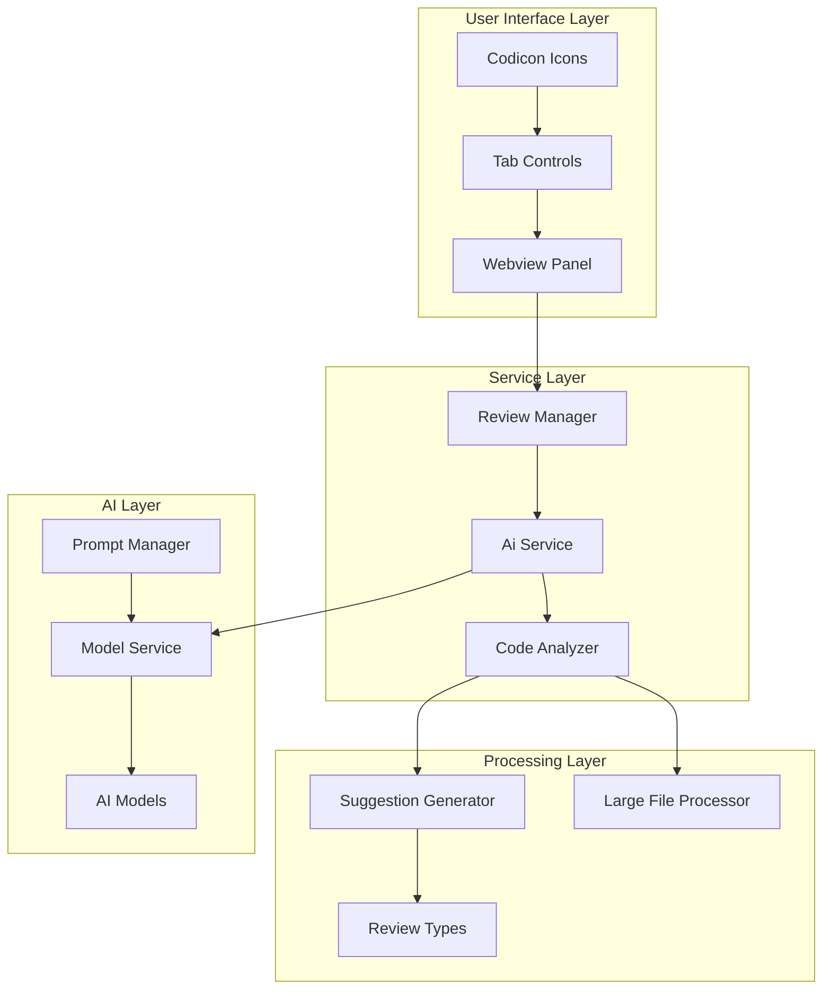
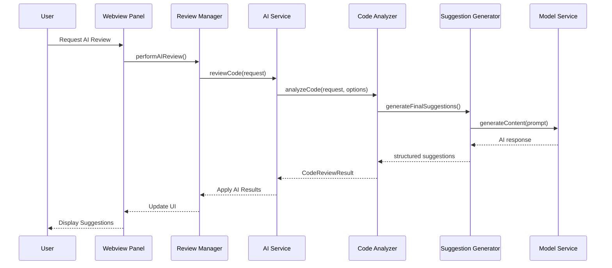
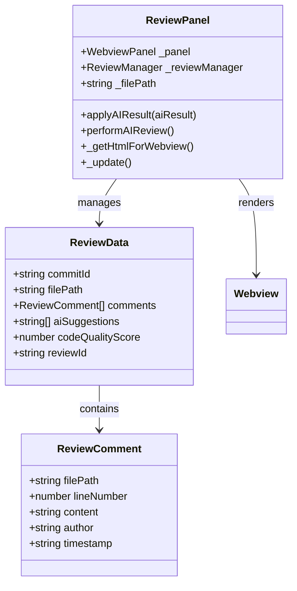
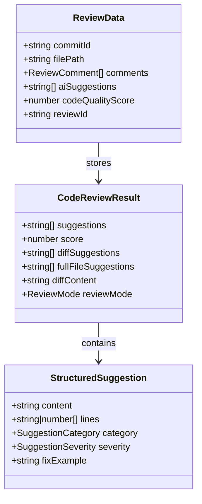

# Understanding AI Suggestions in the Review Panel

<cite>
**Referenced Files in This Document**
- [reviewPanel.ts](file://src/ui/views/reviewPanel.ts)
- [codeAnalyzer.ts](file://src/core/review/codeAnalyzer.ts)
- [reviewManager.ts](file://src/services/review/reviewManager.ts)
- [suggestionGenerator.ts](file://src/core/review/suggestionGenerator.ts)
- [reviewTypes.ts](file://src/core/review/reviewTypes.ts)
- [aiService.ts](file://src/services/ai/aiService.ts)
- [prompts.ts](file://src/i18n/en/prompts.ts)
</cite>

## Table of Contents
1. [Introduction](#introduction)
2. [System Architecture Overview](#system-architecture-overview)
3. [Data Flow Architecture](#data-flow-architecture)
4. [AI Suggestions Categories](#ai-suggestions-categories)
5. [Webview Rendering System](#webview-rendering-system)
6. [Quality Scoring Mechanism](#quality-scoring-mechanism)
7. [Common AI Feedback Patterns](#common-ai-feedback-patterns)
8. [User Interaction Workflow](#user-interaction-workflow)
9. [Implementation Details](#implementation-details)
10. [Best Practices and Guidelines](#best-practices-and-guidelines)

## Introduction

The CodeKarmic extension provides sophisticated AI-generated code suggestions through a comprehensive review panel system. This system analyzes code quality, identifies improvement opportunities, and presents actionable feedback in an intuitive webview interface. The AI suggestions are categorized into distinct types, each serving specific review purposes, and are rendered with Codicon icons for enhanced user experience.

The review panel operates in two primary modes: standalone file review for direct workspace files, and Git commit-based review for analyzing changes within version control contexts. Both modes leverage advanced AI analysis capabilities to provide comprehensive code review insights.

## System Architecture Overview

The AI suggestion system follows a layered architecture that separates concerns between data collection, analysis, processing, and presentation:



**Diagram sources**
- [reviewPanel.ts](file://src/ui/views/reviewPanel.ts#L1-L50)
- [reviewManager.ts](file://src/services/review/reviewManager.ts#L1-L50)
- [aiService.ts](file://src/services/ai/aiService.ts#L1-L50)

## Data Flow Architecture

The data flow from code analysis through suggestion generation to webview rendering follows a structured pipeline:



**Diagram sources**
- [reviewPanel.ts](file://src/ui/views/reviewPanel.ts#L149-L240)
- [reviewManager.ts](file://src/services/review/reviewManager.ts#L290-L310)
- [aiService.ts](file://src/services/ai/aiService.ts#L74-L118)

**Section sources**
- [reviewPanel.ts](file://src/ui/views/reviewPanel.ts#L149-L240)
- [reviewManager.ts](file://src/services/review/reviewManager.ts#L290-L310)
- [aiService.ts](file://src/services/ai/aiService.ts#L74-L118)

## AI Suggestions Categories

The system organizes AI suggestions into distinct categories, each targeting specific aspects of code quality and development practices:

### 1. Diff Analysis Suggestions
Focused on changes introduced in the current commit or file modification. These suggestions analyze the differences between previous and current code versions to identify potential issues or improvements in the specific changes made.

### 2. Full File Analysis Suggestions
Provide comprehensive insights into the entire file's structure, implementation patterns, and overall code quality. These suggestions consider the complete context of the file rather than just recent changes.

### 3. Structural Suggestions
Address code organization, module separation, dependency management, and architectural patterns. These suggestions help improve code maintainability and scalability.

### 4. Performance Optimization Suggestions
Identify opportunities for improving algorithm efficiency, reducing resource consumption, and optimizing memory usage patterns.

### 5. Security Enhancement Suggestions
Highlight potential security vulnerabilities, input validation gaps, and best practices for secure coding.

### 6. Readability and Maintainability Suggestions
Focus on code formatting, naming conventions, comment adequacy, and overall code comprehension factors.

**Section sources**
- [suggestionGenerator.ts](file://src/core/review/suggestionGenerator.ts#L12-L45)
- [codeAnalyzer.ts](file://src/core/review/codeAnalyzer.ts#L58-L76)

## Webview Rendering System

The webview system renders AI suggestions through a tabbed interface with specialized components for different types of review data:



**Diagram sources**
- [reviewPanel.ts](file://src/ui/views/reviewPanel.ts#L5-L100)
- [reviewTypes.ts](file://src/core/review/reviewTypes.ts#L11-L30)

### Tab Structure and Rendering

The webview presents suggestions through three main tabs:

1. **Comments Tab** (`$(comment-discussion)`): Displays user-added comments and discussions
2. **AI Suggestions Tab** (`$(lightbulb)`): Shows AI-generated suggestions and quality scores
3. **Add Comment Tab** (`$(edit)`): Provides form for adding new comments

Each tab utilizes specific HTML templates and CSS styling to present information effectively:

**Section sources**
- [reviewPanel.ts](file://src/ui/views/reviewPanel.ts#L454-L511)
- [reviewPanel.ts](file://src/ui/views/reviewPanel.ts#L478-L493)

## Quality Scoring Mechanism

The system employs a comprehensive scoring mechanism that evaluates code quality on a scale of 0-10:

### Scoring Criteria

| Score Range | Quality Level | Description |
|-------------|---------------|-------------|
| 9-10 | Excellent | Minimal suggestions, high-quality code |
| 7-8 | Good | Few suggestions, mostly good practices |
| 5-6 | Average | Moderate suggestions, room for improvement |
| 3-4 | Poor | Many suggestions, significant improvements needed |
| 1-2 | Critical | Numerous issues requiring immediate attention |

### Score Calculation Logic

The scoring system considers multiple factors:

1. **Suggestion Count**: Fewer suggestions generally indicate higher quality
2. **Issue Severity**: Critical issues lower the score more significantly
3. **Pattern Recognition**: Consistent adherence to best practices improves scores
4. **Context Awareness**: Understanding of project-specific requirements

**Section sources**
- [codeAnalyzer.ts](file://src/core/review/codeAnalyzer.ts#L194-L228)
- [suggestionGenerator.ts](file://src/core/review/suggestionGenerator.ts#L158-L176)

## Common AI Feedback Patterns

The AI system generates suggestions following established patterns that address common code review scenarios:

### Error Handling Improvements
- **Pattern**: "Consider adding comprehensive error handling for edge cases"
- **Context**: Functions without proper exception management
- **Impact**: High - Prevents runtime failures and improves reliability

### Performance Optimizations
- **Pattern**: "The function could be optimized for better performance by caching results"
- **Context**: Repeated calculations or expensive operations
- **Impact**: Medium-High - Improves execution speed and resource usage

### Readability Enhancements
- **Pattern**: "Variable naming could be improved for better code readability"
- **Context**: Unclear or inconsistent naming conventions
- **Impact**: Low-Medium - Enhances code comprehension and maintenance

### Security Considerations
- **Pattern**: "Input validation should be implemented to prevent injection attacks"
- **Context**: User input processing without sanitization
- **Impact**: High - Critical for application security

### Architecture Improvements
- **Pattern**: "Consider separating concerns by moving business logic to service layer"
- **Context**: Tight coupling between presentation and business logic
- **Impact**: Medium-High - Improves maintainability and testability

**Section sources**
- [aiService.ts](file://src/services/ai/aiService.ts#L324-L332)
- [prompts.ts](file://src/i18n/en/prompts.ts#L30-L35)

## User Interaction Workflow

The user interaction with AI suggestions follows a structured workflow:

```mermaid
flowchart TD
Start([User Opens Review Panel]) --> Mode{Review Mode?}
Mode --> |Git Commit| GitMode[Git-Based Review]
Mode --> |Standalone| StandaloneMode[Direct File Review]
GitMode --> SelectCommit[Select Commit]
SelectCommit --> RequestAI[Click "Request AI Review"]
StandaloneMode --> RequestAI
RequestAI --> AnalyzeCode[Code Analysis Process]
AnalyzeCode --> GenerateSuggestions[Generate AI Suggestions]
GenerateSuggestions --> RenderSuggestions[Render in Webview]
RenderSuggestions --> ViewSuggestions[View AI Suggestions Tab]
ViewSuggestions --> InteractFeedback{User Interaction}
InteractFeedback --> |Add Comment| AddComment[Add Comment]
InteractFeedback --> |Request New Review| RequestAI
InteractFeedback --> |Generate Report| GenerateReport[Generate Report]
AddComment --> UpdateUI[Update UI]
GenerateReport --> FinalReport[Final Report]
UpdateUI --> ViewSuggestions
```

**Diagram sources**
- [reviewPanel.ts](file://src/ui/views/reviewPanel.ts#L149-L240)
- [reviewPanel.ts](file://src/ui/views/reviewPanel.ts#L478-L493)

**Section sources**
- [reviewPanel.ts](file://src/ui/views/reviewPanel.ts#L149-L240)
- [reviewPanel.ts](file://src/ui/views/reviewPanel.ts#L478-L493)

## Implementation Details

### Code Review Result Models

The system uses structured data models to represent review results:



**Diagram sources**
- [reviewTypes.ts](file://src/core/review/reviewTypes.ts#L78-L125)
- [suggestionGenerator.ts](file://src/core/review/suggestionGenerator.ts#L39-L50)

### AI Service Integration

The AI service coordinates between different analysis types and provides unified results:

**Section sources**
- [reviewTypes.ts](file://src/core/review/reviewTypes.ts#L78-L125)
- [suggestionGenerator.ts](file://src/core/review/suggestionGenerator.ts#L39-L50)
- [aiService.ts](file://src/services/ai/aiService.ts#L74-L118)

## Best Practices and Guidelines

### Interpreting Quality Scores

- **Score 9-10**: Excellent code quality with minimal suggestions
- **Score 7-8**: Good code with occasional improvement opportunities
- **Score 5-6**: Average code requiring moderate improvements
- **Score 3-4**: Poor code with significant improvement needs
- **Score 1-2**: Critical issues requiring immediate attention

### Understanding Suggestion Priorities

The system categorizes suggestions by severity:

- **Critical**: Immediate fixes required for security or stability
- **High**: Important improvements affecting code quality
- **Medium**: Recommended enhancements for better practices
- **Low**: Minor improvements with minimal impact
- **Info**: General suggestions and best practices

### Effective Use of AI Suggestions

1. **Context Consideration**: Understand the specific context of each suggestion
2. **Priority Assessment**: Focus on high-impact suggestions first
3. **Implementation Planning**: Consider the scope and effort required for each suggestion
4. **Follow-up Reviews**: Periodically reassess code quality after implementing suggestions

### Integration with Development Workflow

The AI suggestion system integrates seamlessly with existing development practices:

- **Continuous Integration**: Automated code review as part of CI/CD pipelines
- **Pair Programming**: Collaborative review sessions using AI insights
- **Code Ownership**: Individual accountability for addressing suggestions
- **Team Standards**: Consistent application of suggested improvements

**Section sources**
- [codeAnalyzer.ts](file://src/core/review/codeAnalyzer.ts#L194-L228)
- [suggestionGenerator.ts](file://src/core/review/suggestionGenerator.ts#L158-L176)