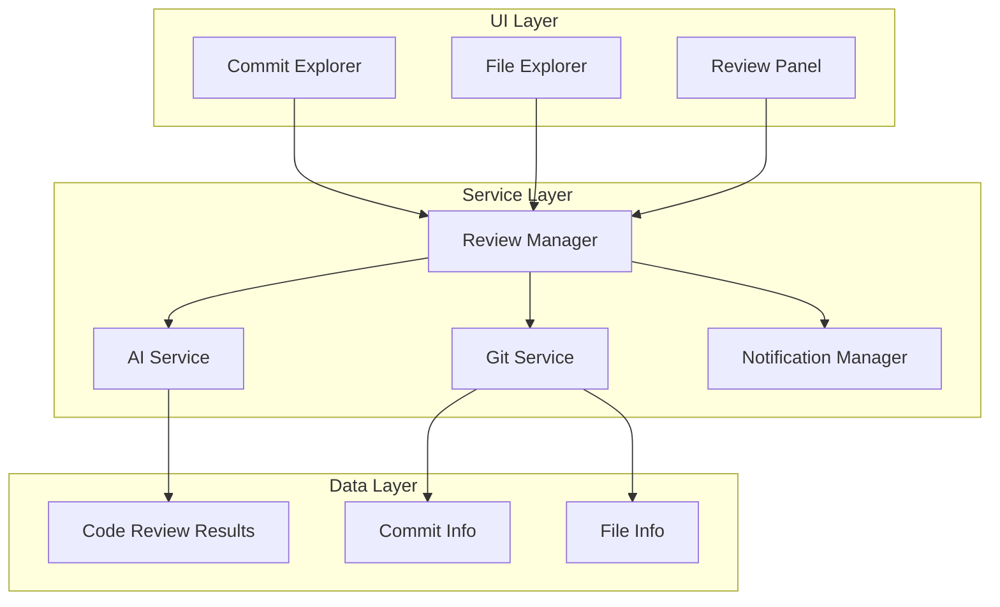
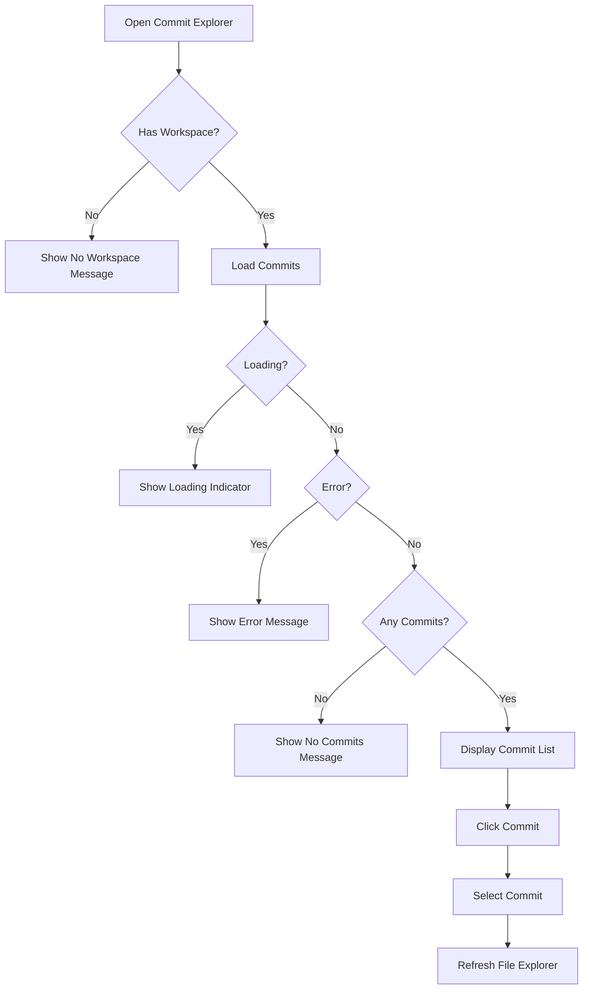
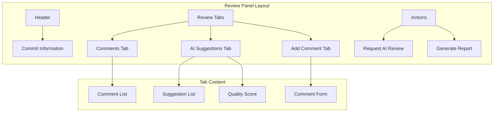
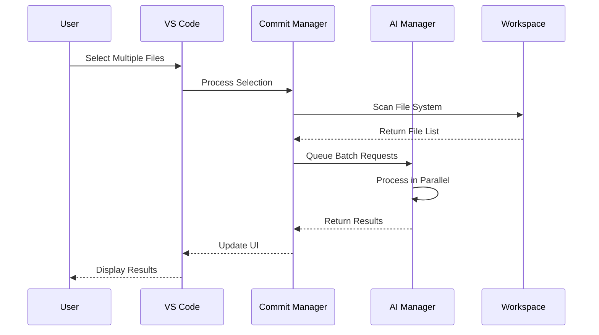
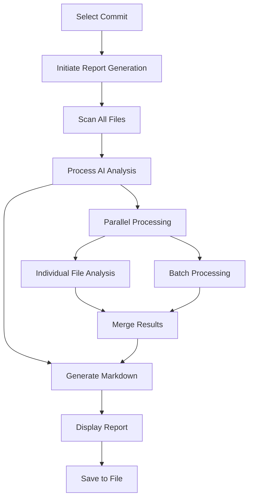

# User Guide

<cite>
**Referenced Files in This Document**
- [package.json](file://package.json)
- [README.md](file://README.md)
- [src/ui/components/commitExplorer.ts](file://src/ui/components/commitExplorer.ts)
- [src/ui/components/fileExplorer.ts](file://src/ui/components/fileExplorer.ts)
- [src/ui/views/reviewPanel.ts](file://src/ui/views/reviewPanel.ts)
- [src/services/review/reviewManager.ts](file://src/services/review/reviewManager.ts)
- [src/services/git/gitService.ts](file://src/services/git/gitService.ts)
- [src/extension.ts](file://src/extension.ts)
- [src/utils/fileUtils.ts](file://src/utils/fileUtils.ts)
- [src/services/ai/aiService.ts](file://src/services/ai/aiService.ts)
- [src/i18n/index.ts](file://src/i18n/index.ts)
</cite>

## Table of Contents
1. [Introduction](#introduction)
2. [Quick Start](#quick-start)
3. [Extension Architecture](#extension-architecture)
4. [Commit Explorer](#commit-explorer)
5. [File Explorer](#file-explorer)
6. [Review Panel](#review-panel)
7. [Core Commands](#core-commands)
8. [Advanced Features](#advanced-features)
9. [Working with AI Suggestions](#working-with-ai-suggestions)
10. [Exporting Reports](#exporting-reports)
11. [Troubleshooting](#troubleshooting)
12. [Best Practices](#best-practices)

## Introduction

CodeKarmic is an AI-powered code review assistant for Visual Studio Code that provides intelligent analysis of Git commits and files. The extension offers a comprehensive code review workflow through three main components: Commit Explorer for browsing Git history, File Explorer for navigating changed files, and Review Panel for AI-driven code analysis.

The extension supports both standalone file review and Git commit-based review, with powerful filtering capabilities and batch processing for efficient code auditing. It integrates seamlessly with VS Code's native Git functionality while providing advanced AI-powered suggestions and insights.

## Quick Start

### Prerequisites

Before using CodeKarmic, ensure you have:
- Visual Studio Code 1.85.0 or higher
- A Git repository with committed changes
- An API key for your preferred AI model (DeepSeek, OpenAI GPT-3.5/GPT-4)

### Initial Setup

1. **Install the Extension**
   - Open VS Code
   - Go to Extensions view (Ctrl+Shift+X or Cmd+Shift+X)
   - Search for "CodeKarmic" and install

2. **Configure API Key**
   - Open Command Palette (Ctrl+Shift+P or Cmd+Shift+P)
   - Type "Configure API Key" and select it
   - Enter your AI service API key when prompted

3. **Open Code Review Sidebar**
   - Click on the Code Review icon in the Activity Bar
   - Or press Ctrl+Shift+E (Cmd+Shift+E on macOS) to toggle the sidebar

### Basic Workflow

1. **Select a Commit** from the Commit Explorer
2. **Browse Changed Files** in the File Explorer
3. **Open Review Panel** for detailed analysis
4. **Request AI Review** to get intelligent suggestions
5. **Add Comments** and track improvements

**Section sources**
- [README.md](file://README.md#L8-L15)
- [package.json](file://package.json#L26-L35)

## Extension Architecture

CodeKarmic follows a modular architecture built around three primary UI components and supporting services:



**Diagram sources**
- [src/ui/components/commitExplorer.ts](file://src/ui/components/commitExplorer.ts#L5-L172)
- [src/ui/components/fileExplorer.ts](file://src/ui/components/fileExplorer.ts#L6-L224)
- [src/ui/views/reviewPanel.ts](file://src/ui/views/reviewPanel.ts#L5-L621)
- [src/services/review/reviewManager.ts](file://src/services/review/reviewManager.ts#L79-L854)

### Core Components

**Commit Explorer**: Provides hierarchical view of Git commits with filtering capabilities
**File Explorer**: Displays files changed in selected commits with status indicators
**Review Panel**: Webview-based interface for AI analysis and interactive code review

**Section sources**
- [src/ui/components/commitExplorer.ts](file://src/ui/components/commitExplorer.ts#L5-L172)
- [src/ui/components/fileExplorer.ts](file://src/ui/components/fileExplorer.ts#L6-L224)
- [src/ui/views/reviewPanel.ts](file://src/ui/views/reviewPanel.ts#L5-L621)

## Commit Explorer

The Commit Explorer is the primary interface for browsing Git history and selecting commits for review.

### Navigation and Interaction



**Diagram sources**
- [src/ui/components/commitExplorer.ts](file://src/ui/components/commitExplorer.ts#L36-L128)

### Features

**Commit Listing**: Displays commits with hash, date, author, and message preview
**Hierarchical View**: Commit details expand to show author information, date, and file count
**Status Indicators**: Loading, error, and no-commits states with appropriate messaging
**Interactive Elements**: Click to select commits, tooltips with full commit details

### Filtering Options

**Date Range Filtering**:
- Access via "Filter by Date Range" command
- Enter start and end dates in format YYYY-MM-DD
- Automatically refreshes commit list with filtered results

**Commit ID Filtering**:
- Access via "Filter by Commit ID" command
- Enter partial or full commit hash
- Filters commits containing the specified ID

**Section sources**
- [src/ui/components/commitExplorer.ts](file://src/ui/components/commitExplorer.ts#L36-L128)
- [src/extension.ts](file://src/extension.ts#L537-L607)

## File Explorer

The File Explorer displays files changed in the currently selected commit, providing quick access to reviewable content.

### File Status Indicators

```mermaid
graph LR
A[File Status] --> B[Added [A]]
A --> C[Modified [M]]
A --> D[Deleted [D]]
A --> E[Renamed [R]]
A --> F[Copied [C]]
A --> G[Binary [B]]
B --> H[Green Icon]
C --> I[Blue Icon]
D --> J[Red Icon]
E --> K[Yellow Icon]
F --> L[Purple Icon]
G --> M[Gray Icon]
```

**Diagram sources**
- [src/ui/components/fileExplorer.ts](file://src/ui/components/fileExplorer.ts#L101-L224)

### File Information Display

Each file entry shows:
- **Status**: Visual indicator (added, modified, deleted, renamed, copied, binary)
- **Statistics**: Insertions and deletions (+X -Y format)
- **File Type**: Proper icon based on file extension
- **Path**: Full file path for easy navigation

### Interactive Features

**File Selection**: Click to open in editor or review panel
**Context Menu**: Right-click for additional actions
**Refresh Button**: Update file list when commit changes
**Filtering**: Automatically updates when commit selection changes

**Section sources**
- [src/ui/components/fileExplorer.ts](file://src/ui/components/fileExplorer.ts#L20-L98)
- [src/ui/components/fileExplorer.ts](file://src/ui/components/fileExplorer.ts#L101-L224)

## Review Panel

The Review Panel is a sophisticated webview-based interface that provides AI-powered code analysis and interactive review capabilities.

### Interface Layout



**Diagram sources**
- [src/ui/views/reviewPanel.ts](file://src/ui/views/reviewPanel.ts#L242-L621)

### Tab System

**Comments Tab**: Displays user-added comments with author and timestamp
**AI Suggestions Tab**: Shows AI-generated code improvement suggestions
**Add Comment Tab**: Form for adding new comments with line number specification

### AI Analysis Features

**Automatic Analysis**: Click "Request AI Review" to analyze the current file
**Quality Scoring**: AI provides numerical code quality scores (0-10)
**Multiple Suggestion Types**: Standard suggestions, diff-specific suggestions, and full-file analysis
**Progress Tracking**: Real-time progress indicators during analysis

### Standalone Mode

The Review Panel also supports standalone file review when no commit is selected:
- Review individual files outside Git context
- Direct file analysis without commit history
- Same AI capabilities as commit-based review

**Section sources**
- [src/ui/views/reviewPanel.ts](file://src/ui/views/reviewPanel.ts#L242-L621)

## Core Commands

CodeKarmic provides comprehensive command support through VS Code's command palette and context menus.

### Available Commands

| Command | Purpose | Trigger Location |
|---------|---------|------------------|
| `codekarmic.startReview` | Begin code review workflow | Commit Explorer toolbar |
| `codekarmic.generateReport` | Create Markdown report | File Explorer toolbar |
| `codekarmic.configureApiKey` | Set AI service API key | Settings menu |
| `codekarmic.openSettings` | Open extension settings | Settings menu |
| `codekarmic.refreshCommits` | Reload commit list | Commit Explorer toolbar |
| `codekarmic.refreshFiles` | Reload file list | File Explorer toolbar |
| `codekarmic.filterByDateRange` | Filter commits by date | Commit Explorer toolbar |
| `codekarmic.filterByCommitId` | Filter by commit hash | Commit Explorer toolbar |
| `codekarmic.selectModel` | Choose AI model | Settings menu |
| `codekarmic.reviewExplorerItem` | Review selected item | Explorer context menu |
| `codekarmic.togglePane` | Show/hide review panel | Editor title bar |
| `codekarmic.reviewSelectedItems` | Review multiple items | Explorer context menu |
| `codekarmic.debugGit` | Debug Git functionality | Developer tools |

### Command Usage Patterns

**Single File Review**:
1. Navigate to file in Explorer
2. Right-click → "Review File/Folder with AI"
3. Review panel opens with AI analysis

**Batch Review**:
1. Select multiple files/folders in Explorer
2. Right-click → "Review Selected Items with CodeKarmic"
3. Progress indicator shows processing status

**Commit-Based Review**:
1. Select commit in Commit Explorer
2. Files appear in File Explorer
3. Click file to open Review Panel
4. Request AI analysis for detailed review

**Section sources**
- [package.json](file://package.json#L38-L116)
- [src/extension.ts](file://src/extension.ts#L373-L514)

## Advanced Features

### Batch Processing

CodeKarmic supports efficient batch processing for large-scale code review operations:



**Diagram sources**
- [src/extension.ts](file://src/extension.ts#L435-L514)

### File Type Support

CodeKarmic supports review of various file types:

**Programming Languages**: JavaScript, TypeScript, Python, Java, C/C++, Go, Rust, PHP, and many others
**Configuration Files**: Dockerfiles, Makefiles, YAML, JSON, XML
**Documentation**: Markdown files
**Special Files**: Gitignore, EditorConfig, Environment files

### Large File Handling

For files exceeding size limits:
- Automatic compression of large files
- Intelligent content summarization
- Preserved context for meaningful analysis
- Configurable size thresholds

**Section sources**
- [src/utils/fileUtils.ts](file://src/utils/fileUtils.ts#L1-109)
- [src/services/ai/aiService.ts](file://src/services/ai/aiService.ts#L1-200)

## Working with AI Suggestions

### Understanding AI Feedback

The AI analysis provides multiple types of feedback:

**Code Quality Suggestions**: General improvements to code structure, readability, and maintainability
**Bug Prevention**: Identifying potential issues and suggesting preventive measures
**Performance Optimizations**: Recommendations for better algorithmic efficiency
**Security Considerations**: Security-related code improvements and best practices

### Applying Suggestions

**Manual Review**: Carefully evaluate each suggestion against your coding standards
**Selective Implementation**: Apply relevant suggestions while maintaining code intent
**Context Awareness**: Consider the broader context when implementing suggestions
**Testing**: Thoroughly test changes to ensure functionality remains intact

### Managing AI Results

**Suggestion Categories**: Differentiate between minor improvements and major refactoring opportunities
**Priority Levels**: Focus on high-impact suggestions first
**Customization**: Adjust AI analysis parameters for specific project needs
**Feedback Loop**: Learn from AI suggestions to improve future code quality

**Section sources**
- [src/services/ai/aiService.ts](file://src/services/ai/aiService.ts#L15-L32)
- [src/ui/views/reviewPanel.ts](file://src/ui/views/reviewPanel.ts#L580-L620)

## Exporting Reports

### Report Generation

CodeKarmic can generate comprehensive Markdown reports for commit reviews:



**Diagram sources**
- [src/services/review/reviewManager.ts](file://src/services/review/reviewManager.ts#L372-L661)

### Report Content

Generated reports include:
- **Commit Metadata**: Hash, message, author, date
- **File Analysis**: Individual file reviews and summaries
- **AI Suggestions**: Complete list of AI-generated improvements
- **Quality Metrics**: Overall code quality scores
- **Change Statistics**: Insertions, deletions, and file counts

### Export Options

**File Output**: Save report as Markdown file for documentation
**Clipboard**: Copy report content to clipboard for external sharing
**Webview Display**: View formatted report in VS Code webview
**Custom Formatting**: Configurable report structure and content

**Section sources**
- [src/services/review/reviewManager.ts](file://src/services/review/reviewManager.ts#L372-L661)

## Troubleshooting

### Common Issues

**API Key Problems**:
- Verify API key is correctly configured
- Check API key permissions and quotas
- Ensure network connectivity for API calls

**Git Integration Issues**:
- Confirm repository is properly initialized
- Check Git installation and PATH configuration
- Verify repository accessibility

**Performance Problems**:
- Large files may cause delays
- Network latency affects AI response times
- Multiple concurrent operations may slow system

### Diagnostic Tools

**Debug Mode**: Enable debug logging for detailed operation tracking
**Git Debugging**: Special commands for diagnosing Git-related issues
**Network Diagnostics**: Monitor API connectivity and response times
**Performance Monitoring**: Track operation timing and resource usage

### Recovery Procedures

**Reset Configuration**: Clear cached data and reinitialize settings
**Force Refresh**: Manually refresh all components when stuck
**Restart Extension**: Reload VS Code to reset extension state
**Clear Cache**: Remove cached AI results and temporary data

**Section sources**
- [src/extension.ts](file://src/extension.ts#L176-L458)

## Best Practices

### Efficient Review Workflow

**Commit-Based Reviews**: Focus on logical code changes rather than individual files
**Batch Processing**: Use batch review for routine code audits
**Prioritized Analysis**: Address critical issues before minor improvements
**Regular Reviews**: Establish consistent review schedules for ongoing projects

### AI Integration

**Contextual Understanding**: Provide clear context when requesting AI analysis
**Iterative Improvement**: Use AI feedback as starting point, not final solution
**Human Oversight**: Always review AI suggestions carefully before implementation
**Continuous Learning**: Learn from AI feedback to improve coding practices

### Team Collaboration

**Shared Standards**: Establish team-wide coding standards and guidelines
**Review Guidelines**: Develop team-specific review criteria and priorities
**Knowledge Sharing**: Share effective AI suggestions across team members
**Quality Metrics**: Track code quality improvements over time

### Configuration Optimization

**API Settings**: Configure appropriate model and rate limits
**File Filters**: Exclude irrelevant files from automatic review
**Notification Preferences**: Set up appropriate notification levels
**Performance Tuning**: Adjust settings for optimal performance